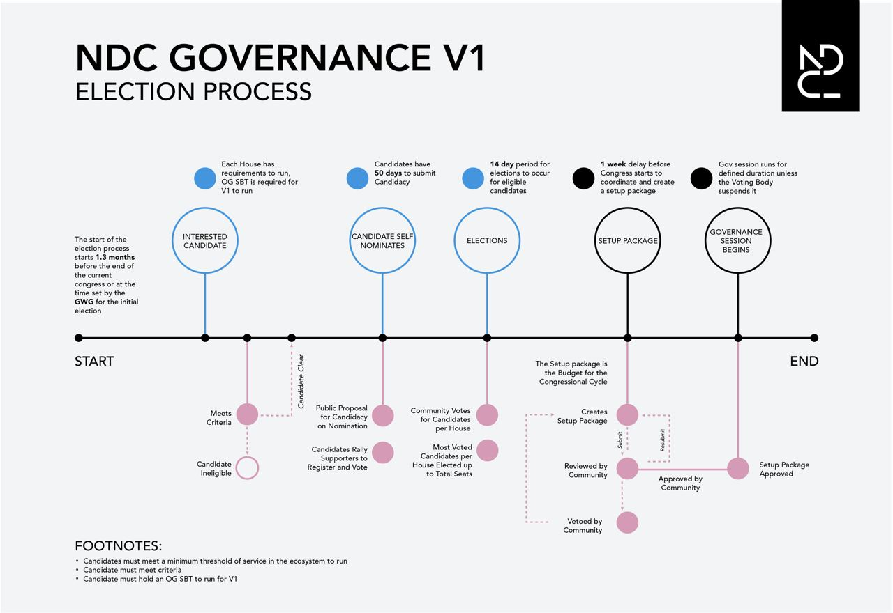

# NDC Gov v1

The NEAR Digital Collective (NDC), the largest decentralization effort on any layer 1 blockchain, has spent much of 2023 designing a number of frameworks that will allow any member of the NEAR Protocol network to have a say in how NEAR is run. NDC’s goal is to combine transparency, collective decision making, evolving governance models, and self-determination in a completely new way.

After laying this decentralization groundwork, the NDC is gearing up for its first elections.

Links:

- [Constitution](./framework-v1/constitution.md)
- [V1 Governance Presentation](https://docs.google.com/presentation/d/1TxEtvXKTblO0kY7pEn54zHvPs2bX-g3i8twJCZatFGE/edit?pli=1#slide=id.g1f5a05682c7_1_60)
- [Elections](#Elections)
  - [voting details](./elections-voting.md)
- [NDC Product Book](https://docs.google.com/document/d/1w_wfRfp-ISH7g-zu7vAFULVvRNwyLGwNIDC1EBkxvu0)
- [Gov Ops Manual](https://docs.google.com/document/d/1l5g7JhaEPUMzjrzXEKw2Za5UmuRyK_9qxj-2-2CxlOE/edit?usp=drivesdk)
- [Community Treasury](./framework-v1/community-treasury.md)
- [List of links and documents](https://thewiki.near.page/gwg-docs)

## Important Dates

- July 19, 15:00:00 UTC - September 7, 23:59:59 UTC — Nominations period. Candidacy submissions on [BOS Nominations Widget](https://near.org/nomination.ndctools.near/widget/NDC.Nomination.Page)
- September 8, 00:00:00 UTC - September 22, 23:59:59 UTC — Congress Elections. BOS Widget WIP

## NDC V1 Governance Structure

NDC V1 Governance includes three elected houses, a voting body, and a community treasury. The qualification to run for V1 governance requires an OG SBT. Elected Community members (OG’s) of each house are responsible for planning, overseeing, and allocating funding aligned with the ecosystems Northstar to grow and decentralize NEAR.

| Name of the House  | House of Merit (HoM)                                                                        | Council of Advisors (CoA)                                                               | Transparency Commission (TC)                                                                                    |
| ------------------ | ------------------------------------------------------------------------------------------- | --------------------------------------------------------------------------------------- | --------------------------------------------------------------------------------------------------------------- |
| Seats              | 15                                                                                          | 7                                                                                       | 7                                                                                                               |
| Responsibilities   | In charge of allocating the treasury and deploying capital for the growth of the ecosystem. | In charge of vetoing proposals from the HoM and guiding the deployment of the treasury. | In charge of keeping behavior of elected officials clean, and making sure cartels do not form in the ecosystem. |
| Commitment         | 5-20 hours weekly with a minimum participation threshold.                                   | 5-20 hours weekly with a minimum participation threshold.                               | 5-20 hours weekly with a minimum participation threshold.                                                       |
| Expertise Required | Budgetary expertise for ecosystem-wide budget planning, treasury management, and review.    | Strategic minds to advise the House of Merit and hold budget veto power.                | Unbiased guardians of the treasury that investigate and remove bad actors.                                      |

## Why Should You Care?

### How can my vote shape the future of the NEAR ecosystem?

By engaging in the election process, you get to help determine the direction of the NDC and the future of decentralization on NEAR. This is not like a presidential election where your vote is a thimble of water added to a sea. Every vote in the NDC election actually makes a difference, and some of the elected positions will likely come down to just a few votes. When the candidates have very different policy positions, each vote has a potentially outsize impact.

### How else does my vote matter?

By participating in the elections process and on-chain voting, you are also contributing to your own on-chain reputation.

### Why should you run for office?

If you’re an OG, we need your expertise and authentic commitment to the continued growth, success, and most importantly… Decentralization of NEAR. This is an opportunity for you to actualize an incredible future for NEAR.

## Nominations

In order to run for office, you must hold an [OG SBT](https://i-am-human.app/community-sbts). These aren’t given out to just anyone; these are for people that have been actively contributing to the NEAR ecosystem for extended periods of time. The OG criteria are discussed separately and are reviewed by the OG Committee.

If you already have an OG SBT, you can [self-nominate](https://www.near.org/nomination.ndctools.near/widget/NDC.Nomination.Page) yourself in order to run for elections.

To find out the full criteria and to see if you qualify, please refer to [Safeguards](#safeguards) and OG. If you still require help, head over to the official NDC Telegram and ask a member of the team for help.

### What information will be available in the candidate profiles?

The candidate profiles are on BOS Nomination and will contain their name, background, affiliation, and policy positions. The profiles should give you a clear overview of what to expect should you select them as your preferred candidate. You can choose to upvote the candidate and comment on the candidate profiles as long as you are registered through [I-AM-HUMAN](https://i-am-human.app).

## Elections

The only criteria to run for elections is to _self nominate_.

Nomination starts the NDC v1 governance process and runs for 50 days and allow the community to rally their candidates. The nomination ends on September 7, and the election starts on September 8 and runs for two weeks. The elected representatives are onboarded for one week, and begin to organize the first government for the NEAR ecosystem.

- Nomination Period: July 19th to September 7th, 2023
- Election Period: September 8th – September 22nd, 2023
- Start of 1st Congress: October 1st – April 1st, 2024

👉 [**Voting Process**](./elections-voting.md)

---

### Participation

The main ways to participate in the NDC election are of course voting for candidates or running as a candidate, but there’s a lot more to it than just that. Through our Nominations platform, voters and candidates will be able to engage with one another discussing policy positions and contribute to candidacy social proof through commenting or upvoting.

### Safeguards

It goes without saying that we want as fair and transparent an election as possible. Given that we are remote, and that the internet can be a strange place, there have been certain safeguards implemented into all NDC elections, that deter poor behavior, and also guarantee that bad actors are punished if they are able to manipulate an election. Election integrity can ultimately be broken down into six clear safeguards:

#### Safeguard 1. Fair Voting Policy

Voters agreement to not sell votes. On behalf of all voters, holding an I-Am-Human verified account, you agree when you vote, that you will not sell your vote. If it turns out that you do sell your vote, you are eligible to post-election enforcement from the TC (see safeguard 6).

#### Safeguard 2. Candidate Agreement to Transparency and Accountability to not buy votes

On the candidates’ side, they all also agree to not buy votes for their election, and are equally eligible for post-election enforcement if they are found guilty.

#### Safeguard 3. Captcha Oracle (not confirmed)

Included in each and every vote, to prevent scripting.

#### Safeguard 4. Ongoing monitoring and Machine Learning

Pikes Peak review Election results ongoing/after. NEAR is fortunate enough to have the data visualization and tracking capabilities of Pikespeak, active and involved in the ecosystem. As a core supporter of NDC, Pikes Peak is also going to be monitoring election results both during and after the election to identify any anomalies and ensure it is done as fairly as possible.

#### Safeguard 5. Whistleblower program and bounty

A proactive initiative is established to counteract users who engage in activities like purchasing votes and other behaviors described in the `fair-voting-policy`. This initiative incorporates incentives for users who report such behaviors, aiming to encourage them to flag these instances and subsequently rewarding them for their vigilance.

Anyone who has knowledge of potential election fraud SHOULD report it. All reports will receive a bounty assuming their claims as to people and impact are justified and accurate.

#### Safeguard 6. Enforcement by Transparency Commission

In the event of any serious election fraud the investigation, and decision to remove, or forever ban either a voter or a candidate, will lie with the Transparency Commission. This means that there is ultimately no escape for a wrongdoer once they have been discovered or accused. The official Transparency Commission process is to field a complaint, investigate the complaint, and then publicly move to either remove, or ban the member in question from further participation.

### FAQ

#### What should I consider before voting for a candidate?

Just like in any civic election, you should familiarize yourself with the policy positions of the candidates as well as their backgrounds. All candidates will have been vetted and have an “OG SBT,” but will likely have widely divergent views on the direction of the NDC. Asking questions and commenting on their platforms can also be a valuable way to get clarity on any positions that seem unclear to you.

#### Can I change my vote once I’ve submitted it?

Since all votes are recorded on the blockchain, they are immutable and cannot be changed after submission. Therefore it is in your best interest to triple check your selections before hitting that “submit” button.

#### What procedures will be in place to ensure election integrity?

We would love to see every single person in the NEAR ecosystem vote in NDC elections, but in order to maintain election integrity, there is one important requirement in order to cast a valid ballot. You will need to have a Face-Verified Soul Bound Token (SBT) linked with a NEAR wallet. You may use your main wallet or create a new one explicitly for the purpose of voting.

#### Does Face Verification mean you have a picture of my face connected to my wallet?

No. [I-AM-HUMAN](https://i-am-human.app) does not store your biometrics. You are also free to request the deletion of any and all data collected in this process should you decide to forfeit your FV SBT.

## Blacklist

A blacklist constitutes a roster of accounts contained within the `Registry` that have been flagged for restriction. Through the application of a ML algorithm or the deliberations of an IAH committee, an account can be added to the blacklist, leading to a suspension of its voting privileges and exclusion from receiving any SBTs. Should an account find itself on the blacklist, there exists a provision for filing an appeal with the committee. Upon approval of the appeal, the user's status will be lifted from the blacklist. For a comprehensive overview, please refer to the detailed I Am Human [Blacklist Specification](https://near-ndc.notion.site/IAH-Flag-Accounts-b5b9c2ff72d14328834e2a0effa22938).

## Post-Election

Election results will be announced on the NDC’s Medium, Telegram, and Discord and will also be viewable in the Election UI. Winning candidates will be highlighted in green.

After the election results are announced, the elected representatives will convene for the first time in the first NDC governance town hall, where we will hear from elected members from the three branches of NDC governance.

## More links

1. [fair-voting-policy]()
2. [Registry docs](https://github.com/near-ndc/i-am-human/tree/master/contracts/registry#readme)
3. [Elections smart contract](https://github.com/near-ndc/voting-v1/tree/master/elections)
4. [IAH](https://i-am-human.gitbook.io/i-am-human-docs/)
5. [Whistleblower program]()
