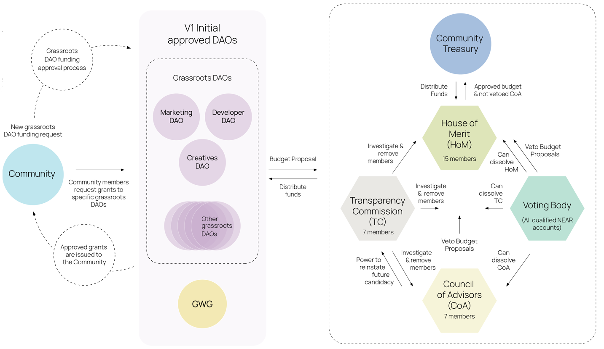

# Community Treasury

The NEAR Community Treasury (hereinafter "NDC Trust") is intended to serve as a decentralised treasury for the NEAR ecosystem.

👉 [Community Treasury Framework](https://near-ndc.notion.site/WIP-Community-Treasury-Framework-1cdbbf304c2846cda641d3c23e702d72?pvs=4)

## Funding HoM

HoM is funded by Community Treasury based on a [Setup Package](https://www.notion.so/Setup-Package-6df6ec7ac92d4703af1fee4a89c61da1). The Setup Package is a document with funding request providing details about the budget and line items. Think of it as the budget plan and rulebook that guides how value is allocated from the community treasury into the ecosystem. There can be more than one setup package proposal per term.

1. HoM makes a proposal for Voting Body to approve a Setup Package.
2. Once the Setup Package is approved, Community Treasury will fund the HoM DAO. The final process is still work in progress. Options

   - Trust will send funds once a month based on the total budget, being approved by the Voting Body.
   - Trust will send funds separately for each line item.

## Funding DAOs

