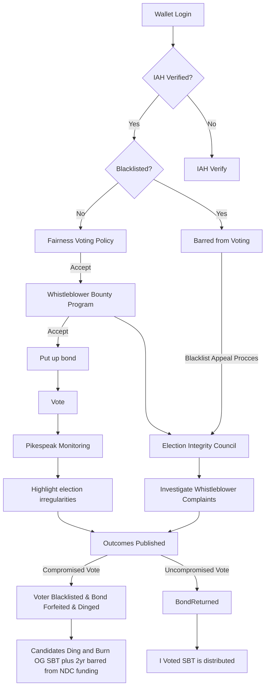

# Elections Voting Process

Elections provides an on-chain method for casting votes and appointing members to various houses. The following documentation outlines the primary steps involved and provides an explanation of the key features that govern the voting process.

## Voting Process

See [Elections](./README.md#Elections) for general overview of the Nominations, Gov v1 and FAQ.

1. Prior to the elections start, the Elections Commission will setup 4 proposals with correct list of candidates, start time, end time and cooldown period:
   - HoM elections
   - CoA elections
   - TC elections
   - Setup Package approval. TODO: needs more details.
1. Once the proposals are active (between start and end time), each [eligible voter](#eligible-voters) can cast only one vote per proposals. Votes can not be updated nor recast.
   - When casting a vote, voter must [bond](#bonding) NEAR.
   - Voter must pay for all storage fees.
1. According to the [safeguards](./README.md#safeguards), Elections Commission will be empowered to [revoke](#vote-revokation) any vote which violates Fair Voting Policy.
1. Elections ends after the cooldown period. At this time, results can be queried from the smart contract.

NOTE: Proposals and candidates can only be submitted by the Elections Commission, following the process approved by the community. Candidates must come from the nominations contract.

### Flow diagram

Original version: https://miro.com/app/board/uXjVMw-RZnM=/

### Cooldown

The cooldown period serves as an intermediary span bridging the conclusion of voting and the establishment of its validity. Within this timeframe, any votes violating the `fair-voting-policy` will be revoked and the corresponding actions outlined in the policy will be enacted against the user.

### Elections End

The Elections contract must have a final end time, which will be a max of `proposal.end + proposal.cooldown + 1 day` of every proposal added to elections. The extra 1 day is required to give a time to setup the tie break.

### Tie Break

- Only matters if there is a tie at the very tail.
- Options: a) extend number of seats, b) reduce number of seats, c) tie break session - elections only for people at tie.
  - Tie break session with reduced voting period (eg 2 days)

In case of a Tie Break, the elections period will be extended and new proposals will be added by the Elections Commission to setup the tie break.

## Eligible Voters

Any person with a Face Verified Soul Bound Token (SBT) is eligible to vote, and anyone can get one with a NEAR wallet through I-AM-HUMAN.

TODO: other criteria that are discussed:

- staking
- bonding
- activity

## Bonding

Bonding entails a mandatory deposit of NEAR tokens that each user must furnish prior to casting their vote. This mechanism operates as a protective measure. The bonded amount remains inaccessible until the voting cooldown period elapses. In the event that a user violates the `fair-voting-policy`, their bonded tokens will be slashed by executing `vote_revoke`.

- Each voter must firstly bond **3N** to cast their vote. It will be integrated in the voting procedure and the contract must return attached tokens (minus the storage fees) if a voter already bonded the tokens.
- One bond is enough to cast votes for all proposals.

## I Voted SBT

The Elections contract will act as an issuer for the IAH Registry.

Once the elections are [over](#elections-end) anyone will be able to recover his bond and claim `I_Voted` SBT by calling `elections.unbond` method. The contract will return the bonded NEAR minus storage fees required to mint the `I Voted` SBT.

## Vote Revocation

Vote revocation is a system put in place to allow for the cancellation of votes that have violated the policy.

Usually such event is paired with the IAH [Blacklist](./README.md#Blacklist). Once a user is blacklisted, any user can initiate the process of revoking blacklisted users votes.

More specifically, elections contract provides a `revoke_vote` method that allows the Elections Commission or `iah_registry` to revoke a vote. In the latter case anyone can trigger the call and the blacklist check will be required.

- Votes can be revoked any time between proposal.start and proposal.end + cooldown period. Revoked vote can't be recast.
- Elections Commission will be able to blacklist any user and revoke any vote.
- Everyone will be able to revoke a vote of a blacklisted user by using `iah_registry.is_human_call`.
