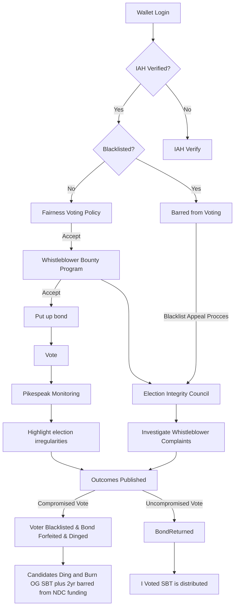

# Elections Voting

Elections provides an on-chain method for casting votes and appointing members to various houses. The following documentation outlines the primary steps involved and provides an explanation of the key features that govern the voting process.

## Flow diagram

## Key features

### Bonding

Bonding entails a mandatory deposit of NEAR tokens that each user must furnish prior to casting their vote. This mechanism operates as a protective measure. The bonded amount remains inaccessible until the voting cooldown period elapses. In the event that a user violates the `fair-voting-policy`, their bonded tokens will be slashed.

### Cooldown

The cooldown period serves as an intermediary span bridging the conclusion of voting and the establishment of its validity. Within this timeframe, any votes violating the `fair-voting-policy` will be revoked and and the corresponding actions outlined in the policy will be enacted against the user.

### Vote Revocation

Vote revocation is a system put in place to allow for the cancellation of votes that have violated the policy. Once a user is blacklisted, any user can initiate the process of revoking their votes. The smart contract features a dedicated function called `revoke_vote` that serves this purpose.

### Blacklist

A blacklist constitutes a roster of accounts contained within the `Registry` that have been flagged for restriction. Through the application of a ML algorithm or the deliberations of an IAH committee, an account can be added to the blacklist, leading to a suspension of its voting privileges and exclusion from receiving any SBTs. Should an account find itself on the blacklist, there exists a provision for filing an appeal with the committee. Upon approval of the appeal, the user's status will be lifted from the blacklist. For a comprehensive overview, please refer to the detailed description available [here](https://near-ndc.notion.site/IAH-Flag-Accounts-b5b9c2ff72d14328834e2a0effa22938).

### Whistleblower Program

A proactive initiative is established to counteract users who engage in activities like purchasing votes and other behaviours desribed in the `fair-voting-policy`. This initiative incorporates incentives for users who report such behaviors, aiming to encourage them to flag these instances and subsequently rewarding them for their vigilance. For more details, see [here](https://

### More links

1. [fair-voting-policy]()
2. [Registry docs](https://github.com/near-ndc/i-am-human/tree/master/contracts/registry#readme)
3. [Elections smart contract](https://github.com/near-ndc/voting-v1/tree/master/elections)
4. [IAH](https://i-am-human.gitbook.io/i-am-human-docs/)
5. [Whistleblower program]()
