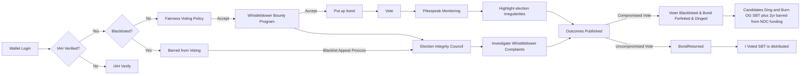

# Elections Voting

## Flow diagram

```mermaid
flowchart LR;
A[Wallet Login] --> B{IAH Verified?};
B --> |Yes| C{Blacklisted?};
B --> |No| D[IAH Verify];
C -->|No| F[Fairness Voting Policy];
C -->|Yes| E[Barred from Voting];
F -->|Accept| G[Whistleblower Bounty Program];
G -->|Accept| H[Put up bond];
H --> I[Vote];
I --> J[Pikespeak Monitoring];
J --> K[Highlight election irregularities];
K --> L[Outcomes Published];
E ----->|Blacklist Appeal Procces| J1[Election Integrity Council];
G -->J1;
J1 --> K1[Investigate Whistleblower Complaints];
K1 --> L;
L --> |Compromised Vote| M[Voter Blacklisted & Bond Forfeited & Dinged];
L --> |Uncompromised Vote| N[BondReturned];
N --> N1["I Voted" SBT is distributed];
M --> M1[Candidates Ding and Burn OG SBT plus 2yr barred from NDC funding];
```

2. TODO: add more docs
