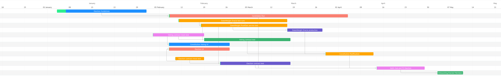

# Ratification and Election Process

The document describes how the process and timeline and process for the NDC v1 ratification. That includes:

- [Constitution](https://github.com/near-ndc/constitution) Ratification
- Election for House of Merit and Council of Advisors

TODO: set amount of members for each house.

## Roadmap

1. NDC to provide guidelines for running a candidacy:
   1. Timeline;
   1. Template document, how a candidate can propose himself.
      Sections: Summary (2 sentences introducing a profile), Motivation Letter, Profile (what the candidate wants to focus on, what is his vision), Resume (achievements, contributions).
   1. Profiles should be described in gov forum – this way users can easily contribute and ask questions.
   1. Guidelines how and where to make polls (let’s focus on 3 solutions max, proposal: NEARSocial, gov forum, telegram).
1. NDC to provide a support team:
   1. Help with communications.
   1. Help to schedule AMMs.
1. NDC & Proximity to provide required smart contract, services and UI for running the voting and elections.
1. NDC to setup a telegram notifications channel. The NDC communication team will provide updates about:
   1. New candidates and copy pasting the summary line;
   1. Scheduled AMMs.
1. Proximity to create Stake Weighted Oracle and proof services (proof generation UI & backend, proof verification smart contract & UI).
1. NDC to create voting contracts: a) constitution ratification and b) elections.
1. Organize 2 workshops about the process (internal and external).
1. Contract demos.

## Voting

_Voting Body_ is the NEAR Ecosystem general assembly for elections, referendums, and voting comprised of every NEAR Account (account) designated as a voting account.

Voting is happening on chain. For v1, the Voting Body is set of accounts staking NEAR, except staking pools and other identified smart contracts and entities who are known to aggregate stake.

The voting mechanism is stake weighted voting. Each account has a variable voting power determined by the amount of NEAR staked at the block height specified in a proposal. Instead of one account = one vote credit, which is gameable in pseudo anonymous world of blockchains (accounts are easy to forge, a proper solution will require human gating mechanism, which is part of the v2 Framework), each account will cast power vote.

Each proposal will have `start_time` and `end_time`. Vote cast can only happen between `start_time` and `end_time` (inclusively).

### Constitution

Constitution Proposal will provide 3 options: `yes`, `no` and `abstain`. The reason we are including abstain is to make the quorum more meaningful: people who don’t want to take a side (yes / no) but want to be counted into the quorum can do so. For example, if the NEAR Foundation doesn’t want to vote yes/no, but want to support the initiative, then NF can vote abstain.

Each account can vote multiple times withing the proposal voting period. Each subsequent vote will overwrite the previous one.
When casting a vote, an account allocates credits equal to his/her voting power to the selected option.
Example: if a voter has 10stake and cast vote by selecting _yes_, the smart contract `#yes` counter will increase by 10 and will add the voters' account to the set of account who already voted.

The proposal passes if both conditions below are met:

- Quorum = 8%: means that sum of all voted stake

        #yes + #no + #abstain>= 0.1 x total_staked_near

- Threshold = 60%: means that:

        #yes > 0.6 x (#yes + #no)

Example of a proposal passing (assuming there are 500 stake in total):

    yes=65stake, no=35stake, abstain=10
    yes=8stake, no=2stake, abstain=50

Example of a proposal NOT passing (assuming there are 500 stake in total):

    yes=60stake, no=40stake, abstain=any – didn’t pass the threshold
    yes=8stake, no=2stake, abstain=20 – not enough quorum

### House of Merit and Council of Advisors

There will be 2 proposals in a StakeWeight Ranking smart contract: one for House of Merit and the second one for Council of Advisors. Each proposal will be filled with a list of candidates who are running for elections.

Each account from the _Voting Body_ will be able to cast 1 vote and support maximum 10 candidates by dividing his/her stake credits between the candidates. Contract tally will happen in real time: candidates will be sorted by rank in the smart contract. In the House of Merits proposal, top `X` (TODO: to be defined) candidates will be selected as the members of the house. Similarly, top `Y` will be selected for Council of Advisors.

Example: we have 50 candidates: `c1, c2, ..., c50`.

- Voter1 has 100stake and will cast his vote by providing whole support for candidate `c10`: after that, `c1` score will increase by 100.
- Voter2 has 200stake and will cast his vote by providing 50stake support for candidate `c1`, 20stake support for candidate `c20` and 140stake support for candidate `c21`. After that, `c1` score will increase by 50, `c20` score will increase by 20 and `c21` score will increase by 140.

## Transparency Commission

TODO: provide process of electing the Transparency Commission
